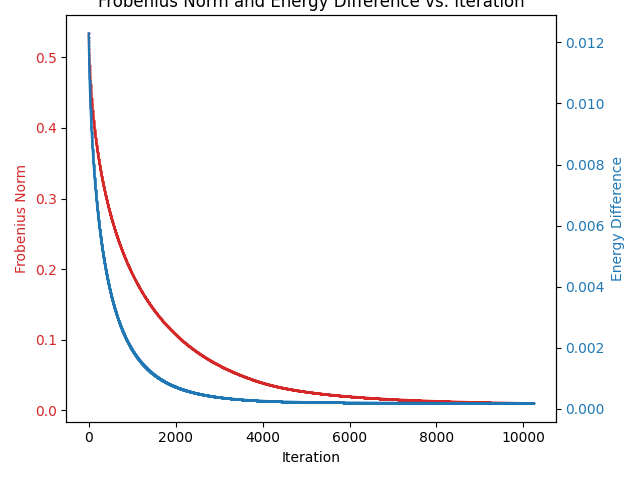

# H2 CAS(2,2) Orbital Optimization

This repository contains Python scripts and mathematical notes for performing orbital optimization on a simple H2 molecule. The main idea is to start from Hartree-Fock orbitals and iteratively minimize the Frobenius norm of the matrix of sines of principal angles between our trial orbitals and the “target” CASSCF orbitals, subject to orthonormality constraints.

We use gradient descent (and variants) to converge to optimized orbitals for a CAS(2,2) active space. Several example scripts are included—some of which use JAX to compute gradients automatically, while others use finite-difference approximations.


## Example Plots

Below are some example figures showcasing how the Frobenius norm and energy difference behave during the orbital optimization process.


_**Figure 1:** The Frobenius norm decreases steadily over iterations, indicating alignment between the trial and CASSCF orbitals._



_**Figure 2:** A comparison of the Frobenius norm and the CASCI–CASSCF energy difference versus iteration._

## Contents

- **`opt_C_v2.py`**  
  Demonstrates an approach that uses JAX-based autodifferentiation for computing gradients of the Frobenius norm objective. Includes a manual re-orthonormalization step (modified Gram-Schmidt) to ensure the orbitals remain orthonormal under the atomic orbital overlap metric.

- **`opt_C_v7.py`**  
  A variant that uses finite-difference approximations for gradients, plus an additional energy difference term in the objective function. Also re-orthonormalizes at each step.

- **`outline.pdf`**  
  A short document describing the underlying theory, including the definition of the Frobenius norm of the matrix of sines of principal angles (our main objective), references to CASCI/CASSCF wavefunctions, orbital rotation operators, and how these fit together in an iterative optimization.

- **Plot images**  
  Several PNG images (for example, `frobenius_norm_opt_v7.png`, `frobenius_norm_and_energy_diff_opt.png`, etc.) showing how the Frobenius norm and the energy difference converge during optimization.

## Key Mathematical Idea

1. **Overlap Matrix**  
   Given two sets of orbitals, \( C_{\text{CASSCF}} \) and \( C_{\text{trial}} \), and the atomic orbital overlap matrix \( S \), we construct:
   $$
   M = C_{\text{CASSCF}}^\dagger \; S \; C_{\text{trial}}.
   $$

2. **Singular Value Decomposition (SVD)**  
   We compute:
   $$
   M = U \Sigma V^\dagger,
   $$
   where \(\Sigma\) contains the singular values \(\sigma_i\). These \(\sigma_i\) can be interpreted as cosines of the principal angles between the subspaces spanned by each set of orbitals.

3. **Frobenius Norm of the Matrix of Sines**  
   We define:
   $$
   ||d||_F = \sqrt{ \sum_i \bigl(1 - \sigma_i^2\bigr) }.
   $$
   Minimizing \( ||d||_F \) pushes the orbitals in \( C_{\text{trial}} \) to align as closely as possible with \( C_{\text{CASSCF}} \).

4. **Gradient Descent**  
   We update $$  C_{\text{trial}} $$ to reduce this measure of misalignment. Each step includes:
   - **Computing** the gradient (via autodiff or finite differences).
   - **Updating** $$ C_{\text{trial}} $$.
   - **Re-orthonormalizing** with respect to \( S \) to ensure the orbitals remain valid.

5. **Including an Energy Term (Optional)**  
   In some versions, we also incorporate \(\lvert E_{\text{CASCI}}(C_{\text{trial}}) - E_{\text{CASSCF}} \rvert\) into the objective, so the algorithm balances both alignment and energy considerations.

## Installation & Requirements

You will need:

- **Python 3.8+** (or similar)
- **NumPy**, **Matplotlib**
- **PySCF** (for quantum chemistry calculations)
- **JAX** (only if running the autodifferentiation script in `opt_C_v2.py`)

A simple way to set this up is via a conda environment:
```bash
conda create -n orbital_opt python=3.9 numpy matplotlib pyscf jax -c conda-forge
conda activate orbital_opt_v7.py```


